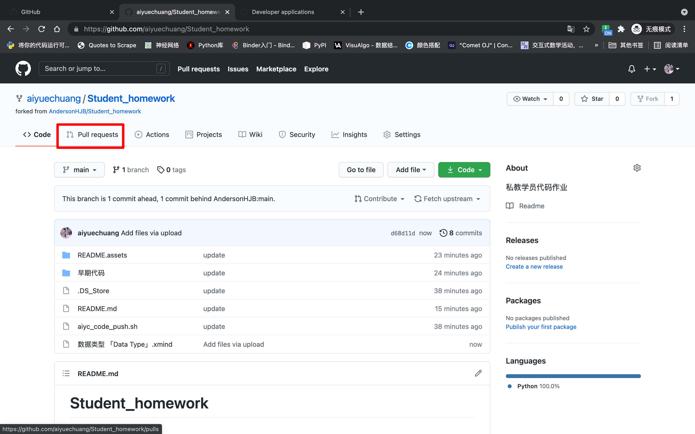
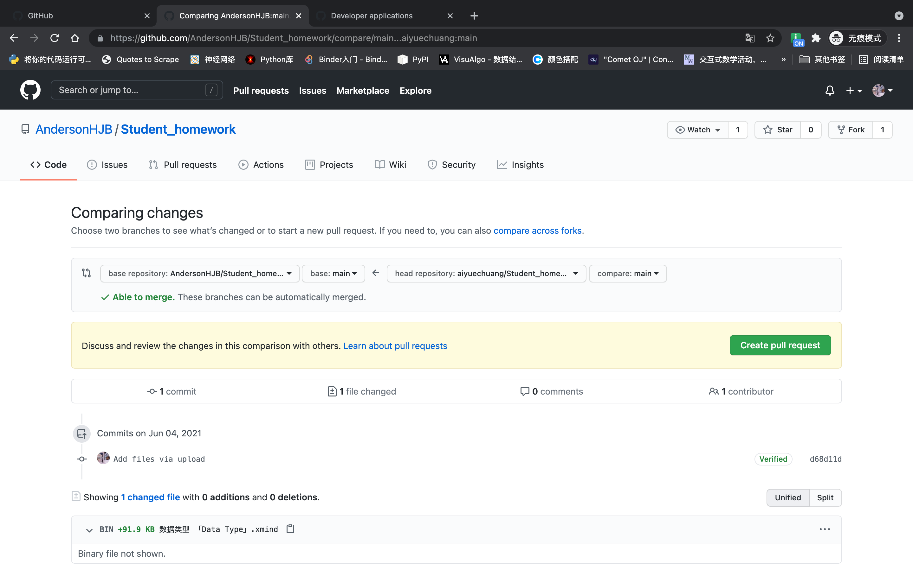
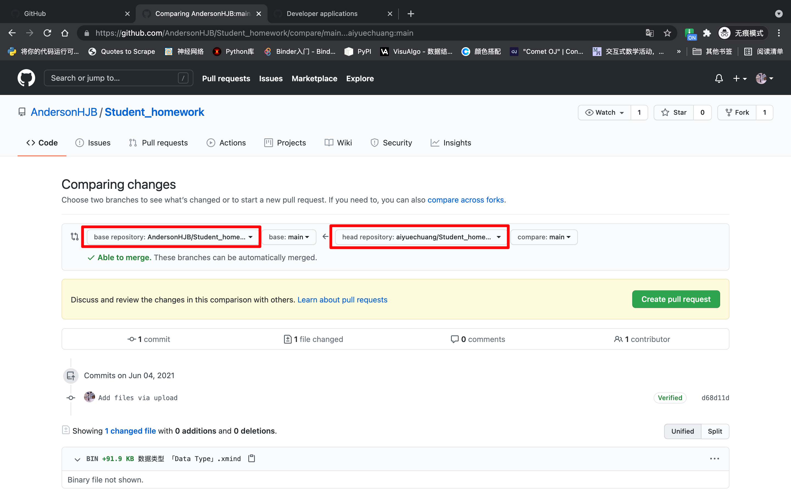

# Student_homework
私教学员代码作业

# 1. 首先 Fork 他人的 repository（代码仓库）

Fork 的名词是  **叉子**  的意思，不过这里取的是动词 **分叉，建一个分支** 的意思。进入你想参与合作开发的仓库界面，点击右上角的 **Fork** 图标，此时你已经复制了一个副本在你的 GitHub 仓库中了，或者是说一个新的代码仓库被创建了，可以打开你的 GitHub 主页看一看。

**注意，这个远程仓库是属于你自己的。这里 Fork 不同于 Clone，Clone 是发生在你的本地机器中，相当于你复制了一个完全相同的副本在你的终端上，但该副本的远程仓库连接的仍然是原作者的仓库，所以你并不是这个项目仓库的拥有者，没有更新它的权限。**

因此，Fork 正是我们所需要的。

点击之后可以看到，自己帐号内有一个新的代码仓库被创建了。

**然后将这个代码仓库 Clone（克隆）到你的本地机器中，**可以使用命令行或者 IDE（比如 Intellij IDEA）的 **VCS** 功能来实现。**Clone** 成功之后你就可以自主修改里面的内容，然后 **Push** 到远程仓库中，注意，这是你自己的远程仓库。**但是不使用 Fork，而是直接 Clone（克隆）原作者的仓库的话，你会得到一个 fatal: unable to access 的提示，无法访问。**

**在这一环节，所有的修改只发生在你的远程仓库中，原作者的代码仓库内容是不会发生任何改变的。这里最需要理解的是，Clone 下来的本地仓库连接的是你 GitHub 上的远程仓库。**

# 2. 开始参与开发前的一些准备

（1）在你做任何开发前，最好先详细阅读该项目的 **CONTRIBUTING.md 文件**。

（2）浏览该项目的 **Issues（问题）**公告，甚至可以自己创建一个 **Issue**。

（3）一般不要将自己做的修改提交到 **master branch（主分支）**上，而是应该提交到某个明确的 **topic branch（主题分支，解决某个 bug  或者添加某一功能的分支）**上。**注意，我们应该自己建一个 topic branch，然后在上面作修改，而不在 master 分支直接修改，因为这样更具有直观性。**

（4）最好每次只提交较小的修改，并写好清晰明确的 **Commit Messages（提交说明）**.

（5）如果有需要，请更新 **README 文件**。

# 3. 创建一个 Pull Request

按自己的需要去修改项目内容，然后将所做的修改提交（Add+Commit）到自己的代码仓库，接着到仓库页面，点击 **New pull request** 按钮。

点击去之后可以看到，左边红框是你 Fork 的原项目仓库和分支，右边红框是你当前选择的项目仓库和分支。

**其实这里就是将两个红框内的内容作对比，并把不相同的地方显示出来。** 因为此时两个仓库和分支的内容是不一样的，所有显示出了一些修改区别。
